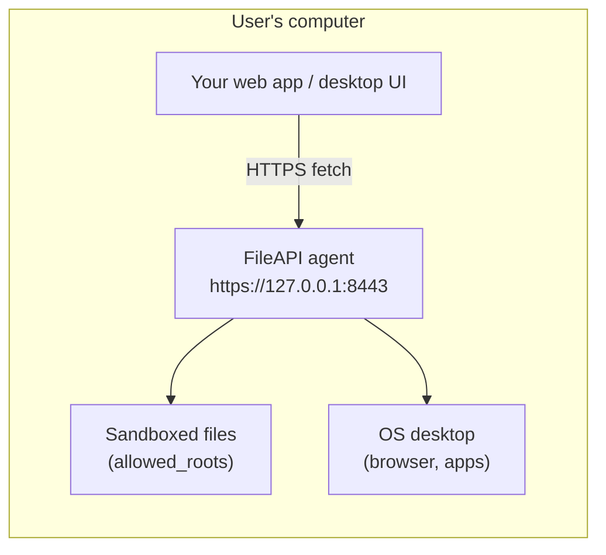
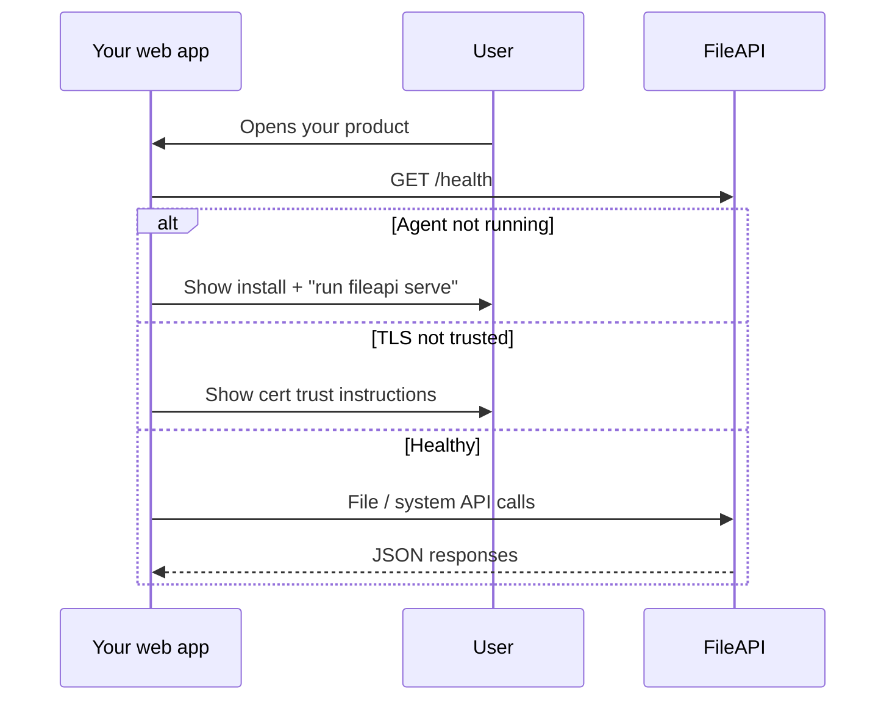

# FileAPI — Agent Handover

This document explains how **FileAPI** works so another AI agent (or engineering team) can design and build a **product that uses FileAPI** as its local desktop bridge.

FileAPI is **not** a cloud service. It is a **small HTTPS server that runs on the end user's machine** and exposes a REST API for sandboxed file operations and simple desktop actions.

---

## 1. What you are integrating with

| Property | Value |
|----------|-------|
| **Role** | Local desktop agent / localhost API bridge |
| **Language** | Go 1.22+ (single static binary, no runtime deps) |
| **Default URL** | `https://127.0.0.1:8443` |
| **API base** | `https://127.0.0.1:8443/api/v1` |
| **Health** | `GET https://127.0.0.1:8443/health` |
| **Transport** | HTTPS only (TLS 1.2+), self-signed cert on first run |
| **OpenAPI** | [`api/openapi.yaml`](api/openapi.yaml) |
| **Latest release** | [GitHub Releases](https://github.com/SmallAPIs/FileAPI/releases) (`v1.0.1` at time of writing) |

### Mental model



Your product (typically a **browser-based web app**) calls FileAPI over **loopback HTTPS**. FileAPI performs file I/O and OS actions **as the logged-in user**, within configured limits.

---

## 2. End-user lifecycle (what your product must handle)

### 2.1 Install FileAPI

Users must install and run the agent before your product can talk to it.

**Public repo (one-liner):**

```powershell
# Windows
irm https://raw.githubusercontent.com/SmallAPIs/FileAPI/main/scripts/install.ps1 | iex
```

```bash
# Linux / macOS
curl -fsSL https://raw.githubusercontent.com/SmallAPIs/FileAPI/main/scripts/install.sh | sh
```

**Private repo:** `raw.githubusercontent.com` returns **404** without auth. Use GitHub CLI or a token — see [`README.md`](README.md#private-repository).

After install, `fileapi` is on PATH.

### 2.2 Start and verify

```bash
fileapi serve     # start the agent (foreground)
fileapi status    # check /health
fileapi version   # print release version
```

On first `serve`:

1. Creates config dir (OS-specific, see §5)
2. Writes default `config.yaml`
3. Generates ECDSA P-256 self-signed TLS cert (`cert.pem`, `key.pem`)
4. Listens on `127.0.0.1:8443`

### 2.3 Trust the certificate

Browsers block or warn on self-signed localhost certs until trusted.

| OS | Cert location | Action |
|----|---------------|--------|
| Linux | `~/.config/fileapi/cert.pem` | Trust in browser or system CA store |
| macOS | `~/Library/Application Support/FileAPI/cert.pem` | Keychain → Always Trust |
| Windows | `%AppData%\FileAPI\cert.pem` | Import to Trusted Root CAs |

**Your product should guide users through this step.** Until the cert is trusted, `fetch()` from a web app may fail with a TLS/network error.

Alternative for development: [mkcert](https://github.com/FiloSottile/mkcert) + point `cert_file` / `key_file` in config.

---

## 3. API contract

### 3.1 Response envelope

All JSON endpoints return:

```json
{ "ok": true, "data": { } }
```

```json
{ "ok": false, "error": { "code": "NOT_FOUND", "message": "file not found" } }
```

Helper: [`internal/handlers/response.go`](internal/handlers/response.go)

### 3.2 Endpoints

| Method | Path | Purpose |
|--------|------|---------|
| `GET` | `/health` | Liveness check (outside `/api/v1`) |
| `GET` | `/api/v1/files?path=` | Read file → JSON with `path`, `content`, `size`, `modified_at` |
| `GET` | `/api/v1/files/raw?path=` | Stream raw UTF-8 text (no JSON wrapper; optional gzip) |
| `POST` | `/api/v1/files` | Create file |
| `PATCH` | `/api/v1/files` | Edit file (overwrite or append) |
| `DELETE` | `/api/v1/files?path=` | Delete file |
| `POST` | `/api/v1/system/open-url` | Open `http`/`https` URL in default browser |
| `POST` | `/api/v1/system/open-app` | Open app or file with OS default handler |

### 3.3 Request / response examples

**Health**

```http
GET /health
→ 200 { "ok": true, "data": { "status": "ok" } }
```

**Read file**

```http
GET /api/v1/files?path=/home/alice/notes/todo.txt
→ 200 { "ok": true, "data": { "path": "...", "content": "...", "size": 42, "modified_at": "..." } }
```

**Create file**

```http
POST /api/v1/files
Content-Type: application/json

{
  "path": "/home/alice/notes/new.txt",
  "content": "Hello",
  "create_dirs": true,
  "include_content": true
}
```

- `create_dirs` (optional): create parent directories
- `include_content` (optional, default `true`): if `false`, response omits file body (faster for large writes)

**Edit file**

```http
PATCH /api/v1/files
Content-Type: application/json

{
  "path": "/home/alice/notes/todo.txt",
  "content": "\n- new item",
  "mode": "append",
  "include_content": false
}
```

- `mode`: `"overwrite"` (default) or `"append"`

**Delete file**

```http
DELETE /api/v1/files?path=/home/alice/notes/old.txt
→ 200 { "ok": true, "data": { "path": "...", "deleted": "true" } }
```

**Raw read (performance)**

```http
GET /api/v1/files/raw?path=/home/alice/notes/big.txt
Accept-Encoding: gzip

→ 200 text/plain
Headers: X-File-Path, X-File-Size, Content-Encoding: gzip (if accepted)
```

**Open URL**

```http
POST /api/v1/system/open-url
{ "url": "https://example.com" }
```

Only `http` and `https` schemes are allowed.

**Open app**

```http
POST /api/v1/system/open-app
{ "path": "C:\\Users\\alice\\doc.pdf" }
```

or on macOS by app name:

```http
{ "name": "Safari" }
```

### 3.4 Error codes

| HTTP | `error.code` | When |
|------|--------------|------|
| 400 | `INVALID_REQUEST` | Bad JSON, missing fields, invalid path |
| 400 | `INVALID_URL` | `open-url` with non-http(s) scheme |
| 403 | `FORBIDDEN` | Path outside `allowed_roots` or `..` traversal |
| 404 | `NOT_FOUND` | File does not exist |
| 409 | `ALREADY_EXISTS` | Create on existing file |
| 413 | `FILE_TOO_LARGE` / `REQUEST_TOO_LARGE` | Exceeds size limits |
| 415 | `BINARY_NOT_SUPPORTED` | File is not valid UTF-8 text |
| 500 | `INTERNAL_ERROR` | Server / OS action failure |

Mapping: [`internal/handlers/files.go`](internal/handlers/files.go) (`writeFileError`)

---

## 4. Building a product on top of FileAPI

### 4.1 Recommended integration flow



**Step 1 — Detect agent**

```javascript
const FILEAPI_BASE = 'https://127.0.0.1:8443';

async function isFileAPIRunning() {
  try {
    const res = await fetch(`${FILEAPI_BASE}/health`);
    const body = await res.json();
    return res.ok && body.ok === true;
  } catch {
    return false; // not running, TLS blocked, or CORS/network issue
  }
}
```

**Step 2 — Read a file**

```javascript
async function readFile(absolutePath) {
  const url = `${FILEAPI_BASE}/api/v1/files?path=${encodeURIComponent(absolutePath)}`;
  const res = await fetch(url);
  const body = await res.json();
  if (!body.ok) throw new Error(body.error?.message ?? 'read failed');
  return body.data;
}
```

**Step 3 — Write a file**

```javascript
async function writeFile(absolutePath, content, { append = false } = {}) {
  const method = append ? 'PATCH' : 'POST';
  const mode = append ? 'append' : 'overwrite';
  const res = await fetch(`${FILEAPI_BASE}/api/v1/files`, {
    method,
    headers: { 'Content-Type': 'application/json' },
    body: JSON.stringify({
      path: absolutePath,
      content,
      mode,
      create_dirs: !append,
      include_content: false,
    }),
  });
  const body = await res.json();
  if (!body.ok) throw new Error(body.error?.message ?? 'write failed');
  return body.data;
}
```

### 4.2 Browser / CORS / Private Network Access

FileAPI ships with permissive CORS defaults (`allowed_origins: ["*"]`).

When your web app is served from a **public HTTPS origin** and calls `https://127.0.0.1`, Chrome enforces [Private Network Access](https://developer.chrome.com/blog/private-network-access-preflight). FileAPI responds with:

```
Access-Control-Allow-Private-Network: true
```

Middleware: [`internal/middleware/cors.go`](internal/middleware/cors.go)

**Product implications:**

- Test in Chrome with a real public HTTPS deployment, not only `localhost` dev.
- Expect preflight `OPTIONS` requests before API calls.
- Tighten `allowed_origins` in FileAPI config to your app's origin before production.

### 4.3 Path rules (critical for UX)

File paths must be **absolute** and inside `allowed_roots`.

| Default | `allowed_roots: [user home directory]` |
| Blocked | `..` traversal, paths outside roots, directories (for read/delete), binary/non-UTF-8 content |
| Max size | 10 MB read/write (configurable) |

**Your product should:**

- Always use absolute paths (`/Users/alice/...`, `C:\Users\alice\...`).
- Never assume paths outside the user's home work unless the user reconfigured FileAPI.
- Handle `FORBIDDEN` and `BINARY_NOT_SUPPORTED` gracefully in UI copy.

### 4.4 Performance tips

| Use case | Endpoint |
|----------|----------|
| Small files, need metadata in JSON | `GET /api/v1/files` |
| Large reads, content only | `GET /api/v1/files/raw` + `Accept-Encoding: gzip` |
| Writes where response body is unnecessary | `include_content: false` |

Latency is typically **1–20 ms** for small files (loopback). Dominant costs: TLS handshake (first request), JSON encoding, disk I/O.

---

## 5. Configuration reference

Config file path (auto-created on first run):

| OS | Config directory |
|----|------------------|
| Linux | `~/.config/fileapi/config.yaml` |
| macOS | `~/Library/Application Support/FileAPI/config.yaml` |
| Windows | `%AppData%\FileAPI\config.yaml` |

Example: [`configs/config.example.yaml`](configs/config.example.yaml)

| Key | Default | Meaning |
|-----|---------|---------|
| `host` | `127.0.0.1` | Bind address — keep localhost unless you understand the risk |
| `port` | `8443` | Listen port |
| `allowed_roots` | `[home]` | Sandboxed directories for file CRUD |
| `allowed_origins` | `["*"]` | CORS origins for browser clients |
| `max_read_size_bytes` | `10485760` (10 MB) | Read limit |
| `max_write_size_bytes` | `10485760` (10 MB) | Write limit |
| `cert_file` / `key_file` | auto in config dir | TLS material |

Loader: [`internal/config/config.go`](internal/config/config.go)

---

## 6. Security model (read before shipping)

### What FileAPI enforces today

- **Localhost bind** by default (`127.0.0.1`)
- **HTTPS** with locally generated cert
- **Path sandbox** for file CRUD (`allowed_roots`, no `..`)
- **UTF-8 text only** — rejects binary files on read
- **URL scheme filter** — `open-url` allows only `http`/`https`
- **Request size limits**

### What FileAPI does NOT enforce yet

- **Authentication** — middleware is a no-op stub ([`internal/middleware/auth.go`](internal/middleware/auth.go)). Any local process (or allowed browser origin) can call the API.
- **`open-app` is not path-sandboxed** — unlike file endpoints, it can launch arbitrary apps/paths passed by the caller.
- **Signed binaries** — releases are checksum'd, not code-signed.

### Product security checklist

1. Treat FileAPI as a **high-trust local capability** — only invoke after explicit user intent.
2. Never expose FileAPI beyond the user's machine (do not change `host` to `0.0.0.0` in consumer docs).
3. Set `allowed_origins` to your product's origin in production configs.
4. Narrow `allowed_roots` if your product only needs specific folders (e.g. `~/Documents/MyApp`).
5. Plan for future OAuth/JWT (on roadmap) — design your client to send `Authorization` headers eventually.

---

## 7. Current limitations and roadmap

**Not available today — do not assume these exist:**

| Missing capability | Workaround |
|--------------------|------------|
| Directory listing | Track paths in your product DB |
| Binary file read/write | UTF-8 text only |
| File watching / events | Poll `modified_at` or use your own watcher later |
| Auth tokens | Trust localhost + user-installed agent |
| Background OS service | User runs `fileapi serve` manually (systemd/launchd planned) |
| Signed installers | Verify `SHA256SUMS` from GitHub Release |

**Roadmap** (from README): OAuth/JWT, binary files, directory listing, file watching, OS service install, signed artifacts.

---

## 8. Repository layout (for agents patching FileAPI)

```
cmd/fileapi/main.go          CLI: serve, status, version, help
internal/server/server.go    Route table + HTTPS server
internal/handlers/         REST handlers (files, system)
internal/filesystem/       Path sandbox + UTF-8 validation
internal/middleware/       CORS, auth stub
internal/config/             YAML config loader
internal/tls/                Self-signed cert generation
internal/platform/           OS-specific open-url / open-app
api/openapi.yaml             Machine-readable API contract
scripts/install.sh           Linux/macOS installer
scripts/install.ps1          Windows installer
.github/workflows/release.yml  Blacksmith production releases
```

---

## 9. Suggested product architecture

A typical **CoWork-style** product using FileAPI:

| Layer | Responsibility |
|-------|----------------|
| **Web frontend** | UX, calls FileAPI via `fetch`, handles cert/trust onboarding |
| **FileAPI (local)** | Sandboxed file I/O + open URL/app |
| **Your backend (optional)** | Account, sync metadata, AI — **not** a substitute for local file access |

FileAPI replaces a heavy Electron/Tauri shell for **local file + desktop bridge** concerns. Your cloud backend should not proxy raw filesystem access; let the browser talk to loopback directly (lower latency, better privacy story).

### Minimum viable onboarding UI

1. "Install FileAPI" button → link to install command for user's OS
2. "Start agent" → instruct `fileapi serve` (or detect via `/health`)
3. "Trust certificate" → OS-specific steps with path to `cert.pem`
4. Connection status pill (green when `/health` succeeds)
5. File picker that maps to absolute paths under `allowed_roots`

---

## 10. Testing your integration

```bash
# Terminal 1
fileapi serve

# Terminal 2
curl -k https://127.0.0.1:8443/health
curl -k "https://127.0.0.1:8443/api/v1/files?path=$HOME/test.txt"
curl -k -X POST https://127.0.0.1:8443/api/v1/files \
  -H 'Content-Type: application/json' \
  -d "{\"path\":\"$HOME/test.txt\",\"content\":\"hello\",\"create_dirs\":true}"
```

Use `-k` because of the self-signed cert. Browser clients need trust instead.

---

## 11. Quick reference card

```
Install:   irm install.ps1 | iex   (Win)   curl install.sh | sh   (Unix)
Run:       fileapi serve
Check:     fileapi status  OR  GET /health
API:       https://127.0.0.1:8443/api/v1
Files:     GET/POST/PATCH/DELETE /files
Raw read:  GET /files/raw
Desktop:   POST /system/open-url, /system/open-app
Sandbox:   allowed_roots (default: $HOME)
Auth:      none (stub)
Format:    UTF-8 text only, max 10 MB
Contract:  api/openapi.yaml
```

---

## 12. Questions to resolve in your product design

1. **How will users start FileAPI?** Manual `fileapi serve` today; background service is future work.
2. **Which folders does your app need?** Document whether default home sandbox is enough.
3. **Public web app or local-only?** Public HTTPS requires PNA + cert trust flow.
4. **How do you handle agent absence?** Poll `/health`, show install CTA.
5. **Path UX** — how does the user pick files if there is no directory listing API?

---

*This handover reflects FileAPI at `main` (release `v1.0.1`). Re-read `api/openapi.yaml` and `README.md` if integrating against a newer version.*
